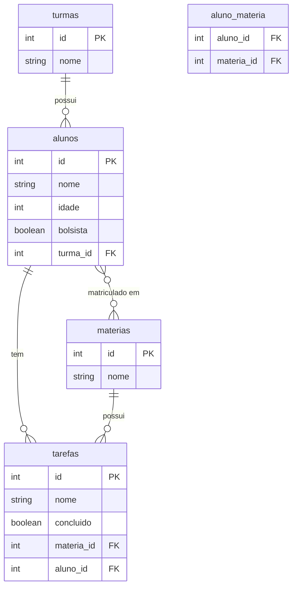

# Diagrama Entidade-Relacionamento - Sistema de Gestão Escolar

## Relacionamentos

### 1. Turma → Aluno (1:N)
- Uma turma possui vários alunos
- Um aluno pertence a apenas uma turma
- Chave estrangeira: `alunos.turma_id`

### 2. Aluno ↔ Materia (N:M)
- Um aluno pode estar matriculado em várias matérias
- Uma matéria pode ter vários alunos
- Tabela associativa: `aluno_materia`
  - `aluno_id` (FK → alunos.id)
  - `materia_id` (FK → materias.id)

### 3. Aluno → Tarefa (1:N)
- Um aluno pode ter várias tarefas
- Uma tarefa pertence a apenas um aluno
- Chave estrangeira: `tarefas.aluno_id`

### 4. Materia → Tarefa (1:N)
- Uma matéria pode ter várias tarefas
- Uma tarefa pertence a apenas uma matéria
- Chave estrangeira: `tarefas.materia_id`

## Cardinalidades no Diagrama

- `||--o{` : Um para muitos (1:N)
- `}o--o{` : Muitos para muitos (N:M)
